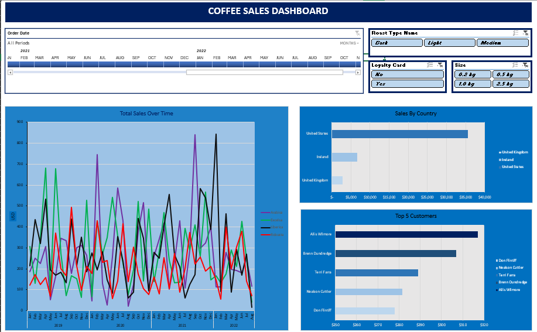

# ☕ Excel Coffee Sales Dashboard Project

This project is a **dynamic Excel dashboard** built for analyzing coffee sales data. It is inspired by the video tutorial ["The ONLY EXCEL PORTFOLIO PROJECT YOU NEED"](https://youtu.be/m13o5aqeCbM?si=5UOYzliYUi2fJuPd) and designed to showcase data analysis and visualization skills using Excel.

The dashboard provides meaningful business insights using PivotTables, PivotCharts, Slicers, and Excel formulas — ideal for data analyst portfolios and job interview presentations.

---

## 📂 Project Structure

| File Name                  | Description                                              |
|----------------------------|----------------------------------------------------------|
| `Data.xlsx`                | Raw dataset containing orders, customers, and products   |
| `coffeOrdersData.xlsx`     | Final Excel dashboard with interactive visuals           |
| `README.md`                | Project overview and setup instructions                  |
| `Dashboard.png`            |  Screenshot preview of the final dashboard               |

---

## 📊 Dashboard Features

- **Key Performance Indicators (KPIs)**:
  - Total Sales
  - Total Profit
  - Total Quantity Sold

- **Visual Charts**:
  - Sales Trend Over Time (Line Chart)
  - Sales by Country (Bar Chart)
  - Profit by Coffee Type and Roast
  - Top 5 Customers by Sales

- **Interactivity**:
  - Slicers for:
    - Date
    - Coffee Type
    - Roast
    - Size
    - Loyalty Card Status

---

## 🛠️ Tools & Techniques Used

- Microsoft Excel 
- PivotTables & PivotCharts
- Slicers for interactivity
- Excel formulas (e.g., `XLOOKUP`, `SUMIFS`, `IF`, `TEXT`, `UNIQUE`)
- Data cleaning and formatting
- Named ranges and cell formatting for dashboard layout

---

## 🚀 How to Use

1. Clone or download this repository.
2. Open the file `coffeeOrdersData.xlsx` in Microsoft Excel.
3. Use the slicers and filters to explore the interactive dashboard.
4. Optionally review `Data.xlsx` to understand the raw data structure.

---

## 📸 Dashboard Preview

---

## 🎯 Key Learnings

Through this project, you’ll learn how to:

- Clean and organize data for analysis
- Create and format PivotTables and PivotCharts
- Use Excel formulas for data transformation
- Build a clean, professional dashboard layout
- Add interactivity using slicers and drop-downs

---

## 📚 Credits

This project was built by following the tutorial created by **Mo Chen** on YouTube.  
📺 [Watch the tutorial here](https://youtu.be/m13o5aqeCbM?si=5UOYzliYUi2fJuPd)

---

## 📝 License

This project is for portfolio purposes. The dataset is sample data and not from a real company.

---

